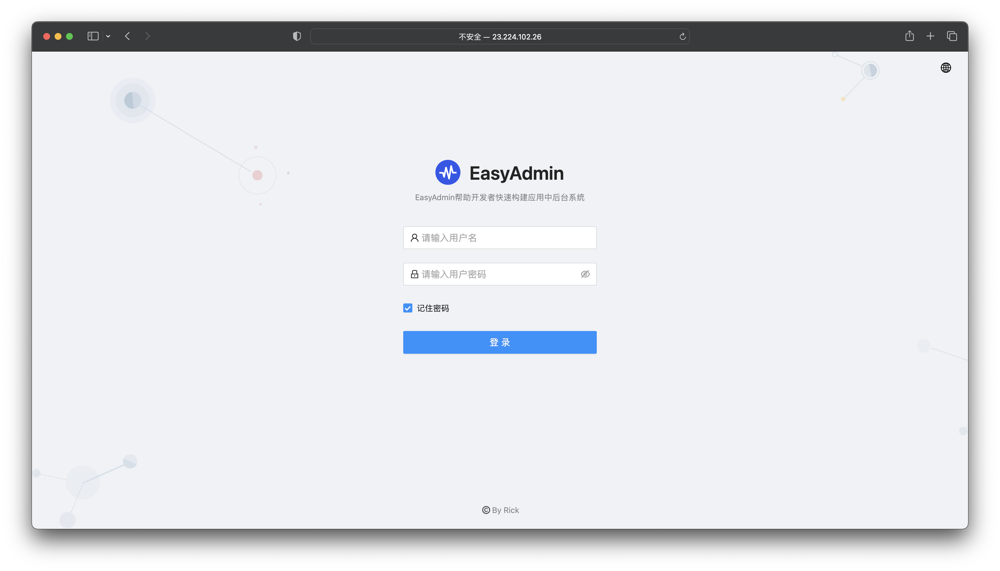
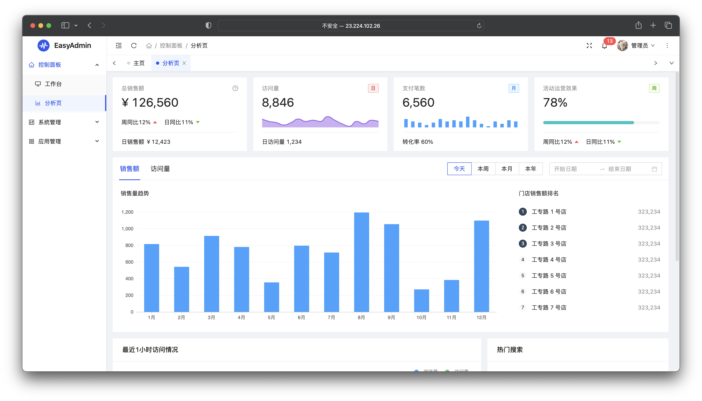
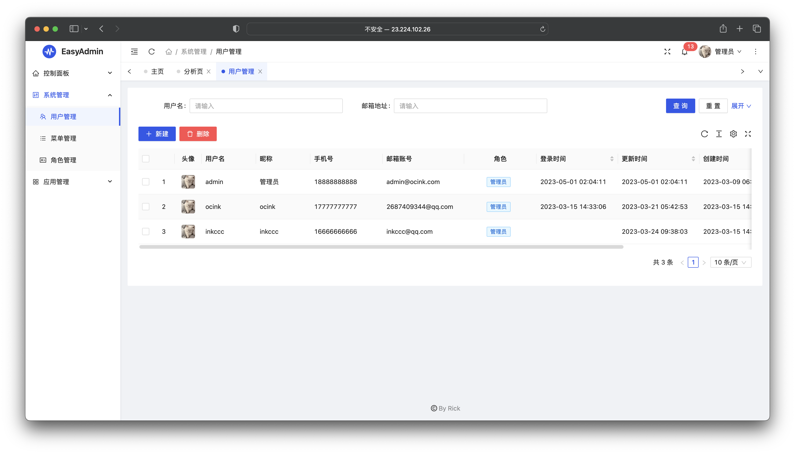
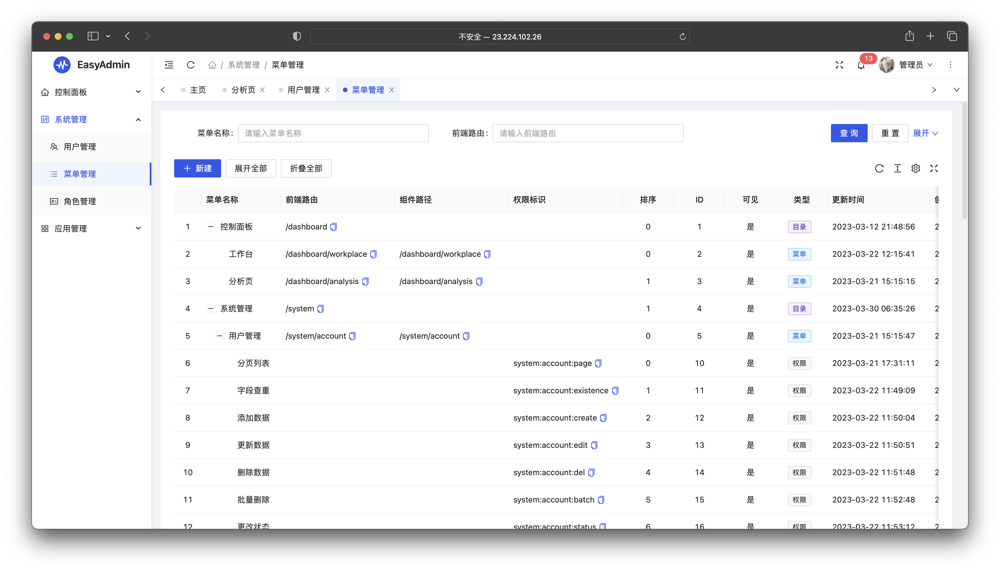
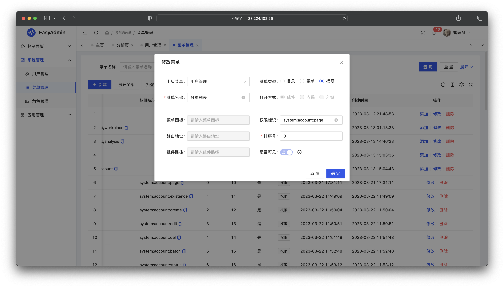
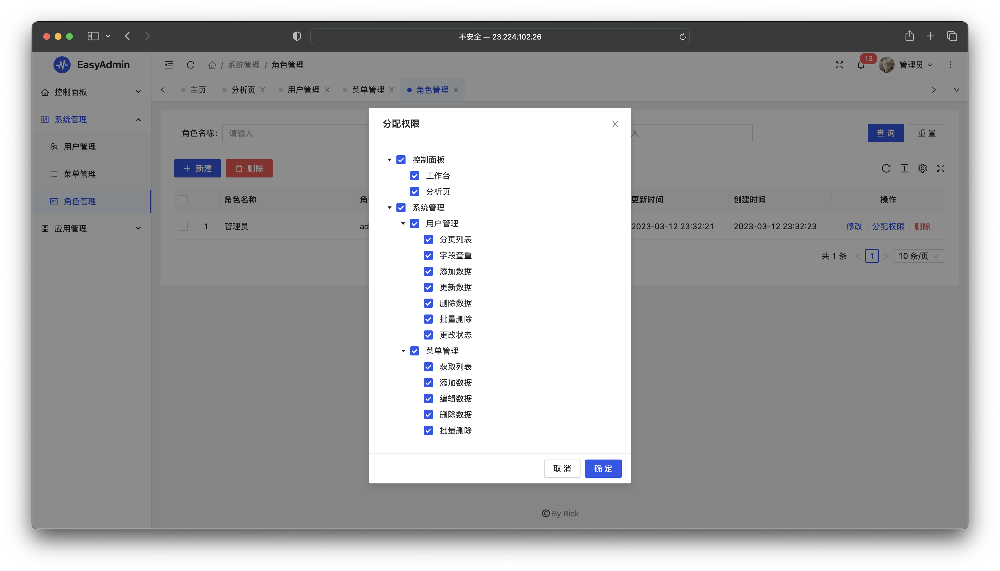
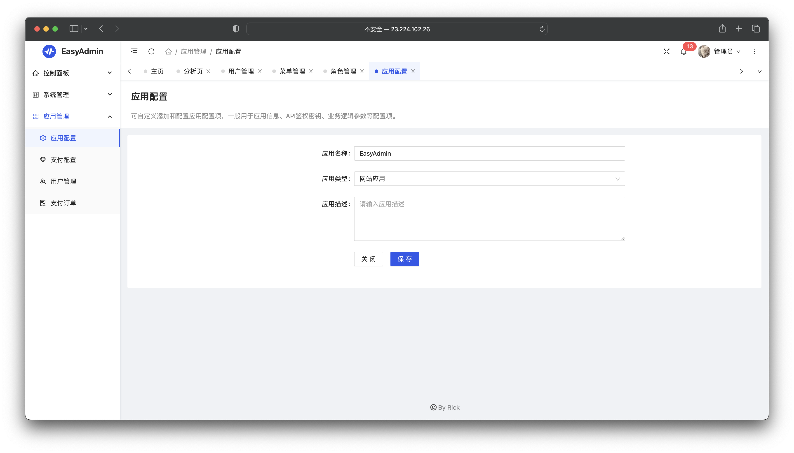
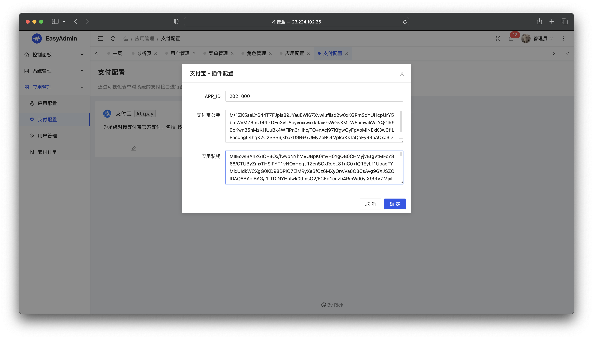
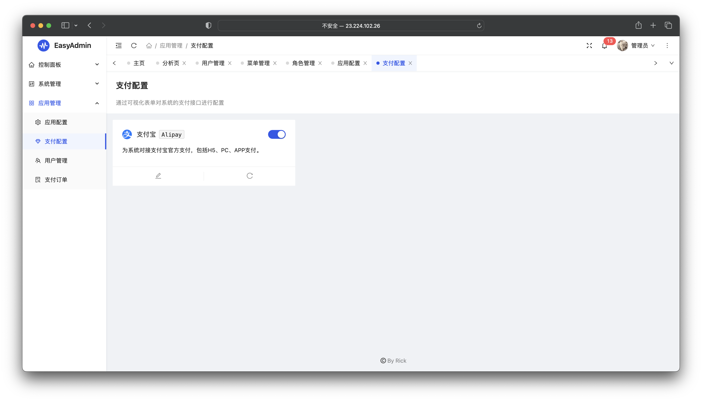
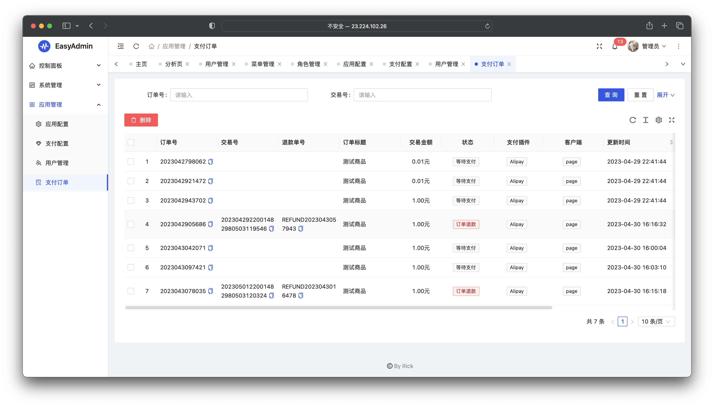

# easyadmin

#### 介绍
基于hyperf实现的中后台快速开发框架，本系统用于本人学习研究使用，欢迎各位大佬指点。
本系统已经完成了完整的后台API，因为前端文件使用的需要商业授权的eleadmin，则无法进行开源。

#### 预览











#### 项目环境
PHP8.1、MySQL5.7、Redis、SWOOLE

#### 部署教程
1. 拉取项目代码
2. 安装程序所需依赖

```
composer install
```
3. 导入数据库

将根目录的admin.sql导入到项目数据库，并且在根目录.env文件配置数据库信息

4. 执行启动命令

```
php bin/hyperf.php start
```
#### 使用docker部署项目


```
//创建一个网络
docker network create sql_network
//创建mysql容器并加入网络 并且导入项目数据
docker run --name mysql-service --network sql_network -p 3306:3306 -e MYSQL_ROOT_PASSWORD=123456 -d mysql:5.7
//创建redis容器并加入网络
docker run --name redis-service --network sql_network -p 6379:6379 -d redis:latest

//创建hyperf容器并加入网络 并且修改根目录.env文件的数据库信息
docker run --name hyperf -v e:/project/easyadmin(这是你本地的开发目录):/data/project/easyadmin -p 9501:9501 -it --privileged -u root --entrypoint /bin/sh --network sql_network -e DB_HOST=mysql-service -e DB_PASSWORD=123456 -e REDIS_HOST=redis-service -d hyperf/hyperf:8.0-alpine-v3.15-swoole

//打开hyperf容器
docker exec -it hyperf bash
//进入项目目录
cd /data/project/easyadmin
//执行启动命令
php bin/hyperf.php start
```


#### 使用说明

1. 如何定义一个权限?

使用程序定义的注解映射类实现，具体用法如下:
```
use App\Annotation\Auth;
use App\Annotation\Permission;
class system
{
    //只验证登录状态 Auth
    #[Auth]
    public function new(): bool
    {
       return true;
    }
    
    //验证登陆状态和权限 Permission('权限标识')
    //随后我们需要在后台添加此标识的权限到数据库中再分配给指定的角色即可
    #[Permission('system:new2')]
    public function new2(): bool
    {
       return true;
    }
}
```

2. 如何发起支付?如何添加创建新的支付插件

我在Api/V1/PayController中实现了一个调用支付的示例，你可以通过通过流程轻松了解发起支付以及回调等过程。
并且可以再Plugin文件夹下根据我写的支付宝对接案例开发其他的支付插件。

3. 如何创建一个系统配置
   需要在数据库中的system_options表中新增数据
   以下是三种配置的示例

|key|type|title|placeholder|value|options|updated_at|created_at|
|--|--|--|--|--|--|--|--|
|app_name|text|应用名称|请输入应用名称|这是网站名称|null|2023-04-03 09:46:37|2023-04-03 09:46:37|
|app_type|select|应用类型|请选择应用类型|1|[{"title": "网站应用", "value": "1"}, {"title": "微信小程序应用", "value": "2"}]|2023-04-03 09:46:37|2023-04-03 09:46:37|
|app_des|textarea|应用描述|请输入应用描述|一款接入ChatGPT的AI图灵工具网|null|2023-04-03 09:46:37|2023-04-03 09:46:37|


据以上所了解，通过type定义配置的前端表单类型，text是文本框，select是下拉选择框，textarea是多文本框，在options字段中对选择框的数据进行定义，定义好的数据通过前端渲染出表单。
